# scalecast-examples

  

- [Read the docs](https://scalecast-examples.readthedocs.io/en/latest/).  
- [scalecast project](https://github.com/mikekeith52/scalecast).  
- `pip install scalecast`  
- Write a notebook or write an article and we will link it and give you credit

## Introduction to scalecast
- [Notebook](./misc/introduction/Introduction2.ipynb)

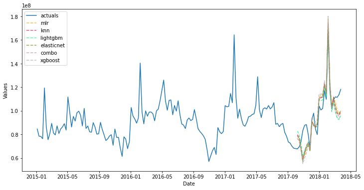

## Anomalies
- [Notebook](./misc/anomalies/anomalies.ipynb)

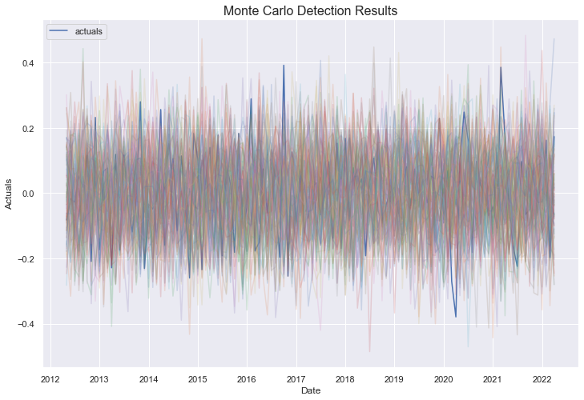

## ARIMA
- [Forecast with ARIMA in Python More Easily with Scalecast](https://towardsdatascience.com/forecast-with-arima-in-python-more-easily-with-scalecast-35125fc7dc2e)
- [Notebook](./arima/arima.ipynb)

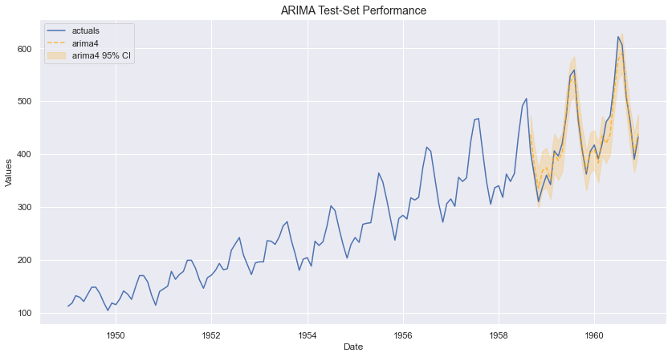

## Auto Xvar Select
- [Auto Model Specification with ML Techniques for Time Series](https://towardsdatascience.com/auto-model-specification-with-ml-techniques-for-time-series-e7b9a90ae9d7)
- [Notebook](./misc/auto_Xvar/auto_Xvar.ipynb)

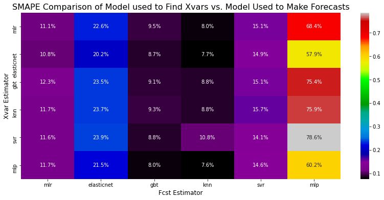

## Combo
- [Notebook](./combo/combo.ipynb)

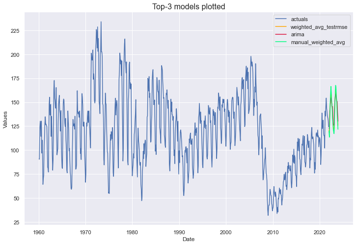

## Confidence Intervals
- [Notebook](./misc/cis/cis.ipynb)

  

## Enplanement/COVID
- [Notebook](./enplanement/enplanements-covid.ipynb)

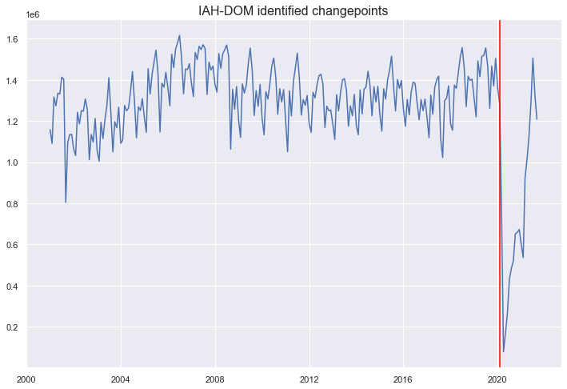

## Feature Reduction
- [Variable Reduction Techniques for Time Series](https://medium.com/towards-data-science/variable-reduction-techniques-for-time-series-646743f726d4)
- [Notebook](./misc/feature-selection/feature_selection.ipynb)

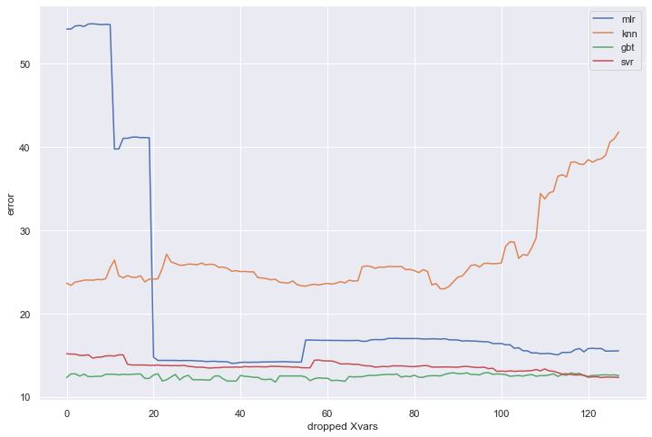

## Forecasting at Scale
- [M4](./m4)  
- [May the Forecasts Be with You](https://towardsdatascience.com/may-the-forecasts-be-with-you-introducing-scalecast-pt-2-692f3f7f0be5)
- [Notebook](https://scalecast-examples.readthedocs.io/en/latest/misc/introduction/Introduction2.html#Scaled-Automated-Forecasting)

## Holt-Winters Exponential Smoothing
- [Notebook](./hwes/hwes.ipynb)

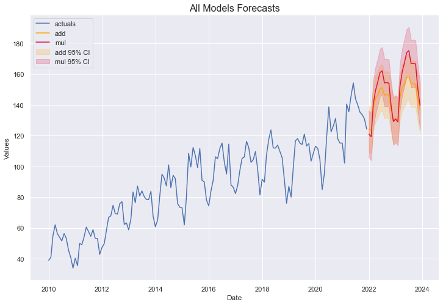

## Prophet
- [Notebook](./prophet/prophet.ipynb)

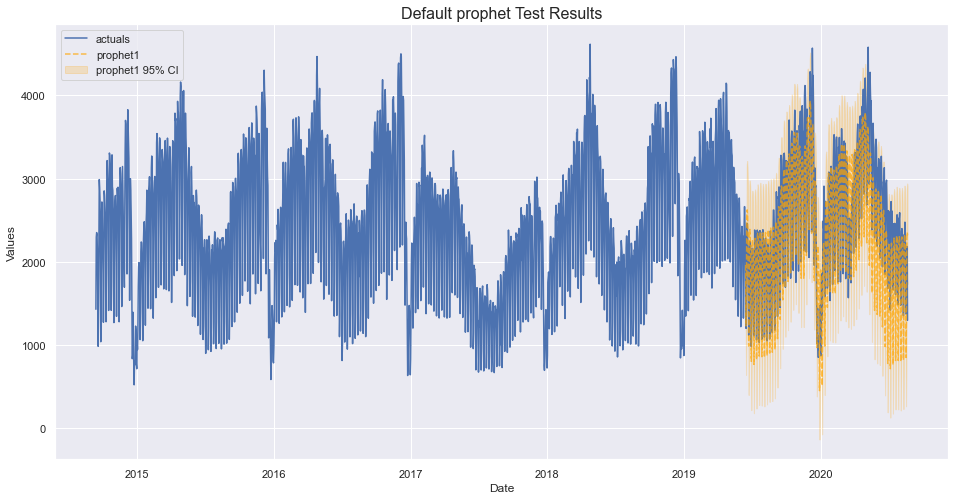

## RNN
- [Exploring the LSTM Neural Network Model for Time Series](https://towardsdatascience.com/exploring-the-lstm-neural-network-model-for-time-series-8b7685aa8cf)
- [LSTM Notebook](./lstm/lstm.ipynb)
- [RNN Notebook](./rnn/rnn.ipynb)

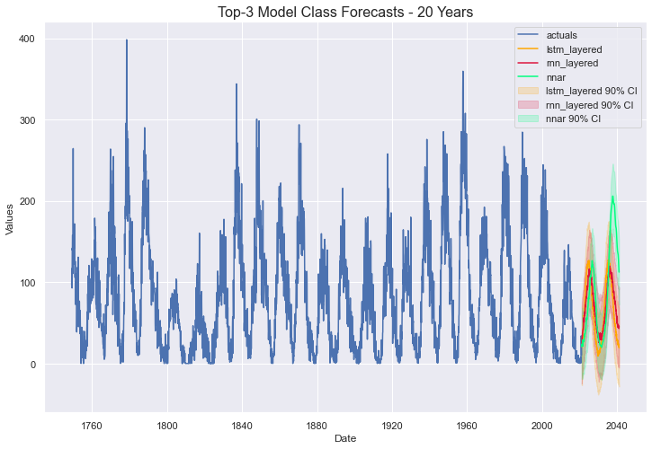

## Silverkite
- [Notebook](./silverkite/silverkite.ipynb)

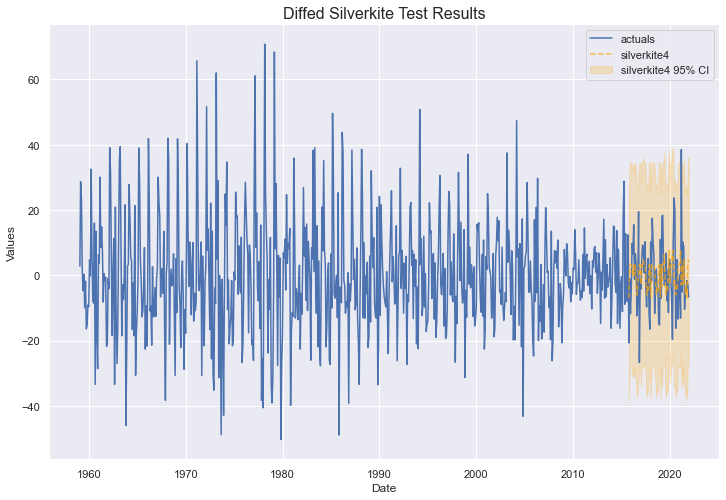

## Sklearn Multivariate
- [Multiple Series? Forecast Them together with any Sklearn Model](https://towardsdatascience.com/multiple-series-forecast-them-together-with-any-sklearn-model-96319d46269)
- [Notebook](./multivariate/multivariate.ipynb)

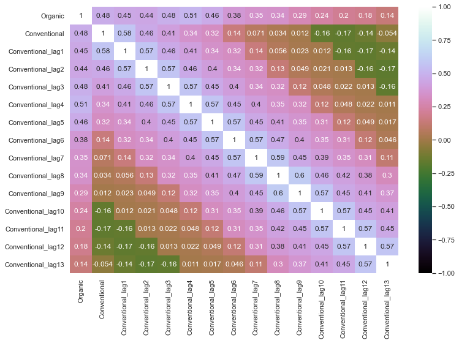

## Sklearn Univariate
- [Expand your Time Series Arsenal with These Models](https://towardsdatascience.com/expand-your-time-series-arsenal-with-these-models-10c807d37558)
- [Notebook](./sklearn/sklearn.ipynb)

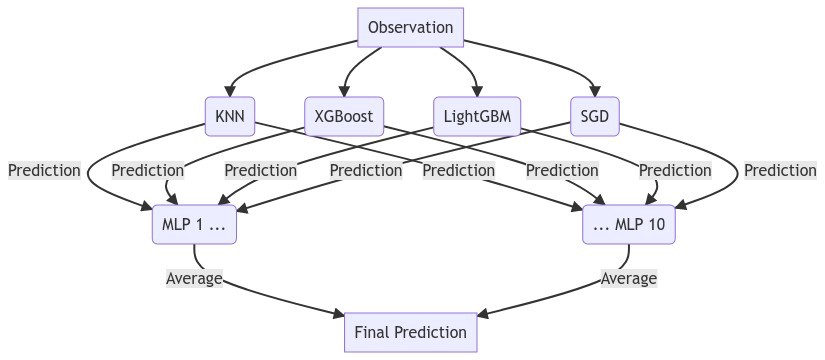

## Theta
- [Notebook](./theta/theta.ipynb)

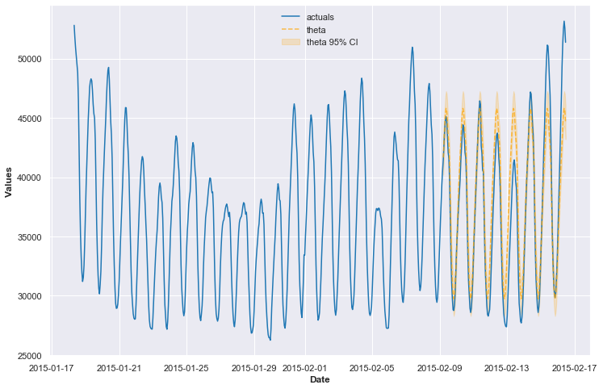

## Validation Methods
- [How Not to be Fooled by Time Series Models](https://towardsdatascience.com/how-not-to-be-fooled-by-time-series-forecasting-8044f5838de3)
- [Model Validation Techniques for Time Series](https://towardsdatascience.com/model-validation-techniques-for-time-series-3518269bd5b3)
- [Notebook 1](./misc/validation/fooled_by_forecasting_models/fooled.ipynb)
- [Notebook 2](./misc/validation/validation.ipynb)

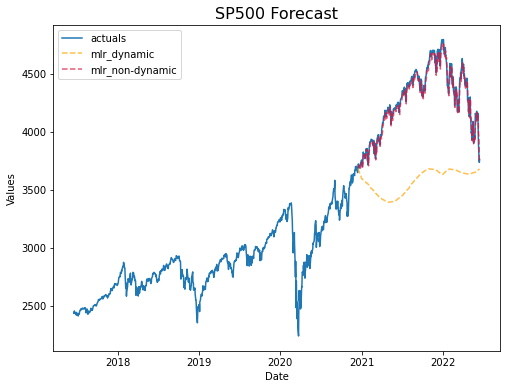

# VECM
- [Employ a VECM to predict FANG Stocks with an ML Framework](https://medium.com/codex/employ-a-vecm-to-predict-fang-stocks-with-an-ml-framework-52f170ec68e6)
- [Notebook](./vecm/vecm.ipynb)

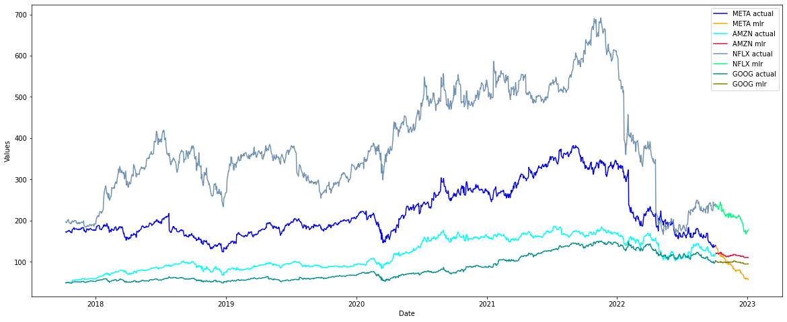